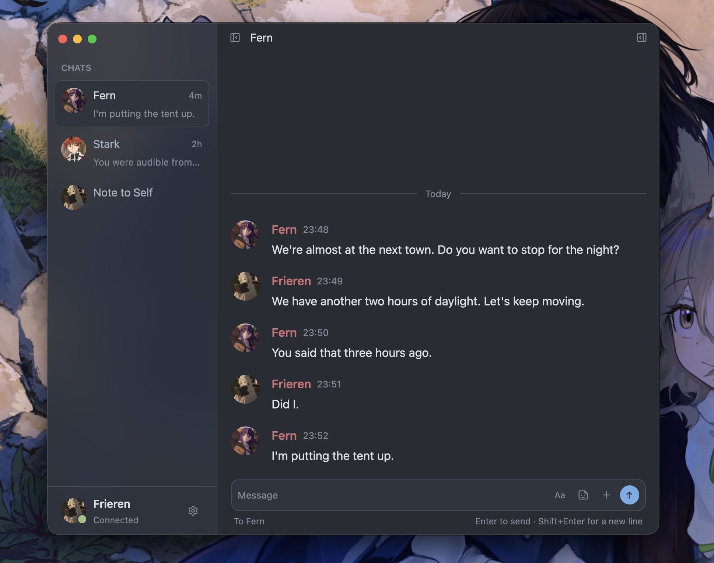

# Petunia

Petunia is a native Signal client, named after the flower.



## What it is

Petunia is built on [gpui](https://gpui.rs), the GUI framework behind Zed,
with [gpui-component](https://github.com/longbridge/gpui-component) for the
window root, icons and text input. It talks to Signal through
[presage](https://github.com/whisperfish/presage).

The look follows Zed: a collapsible sidebar, one focused conversation, and an
optional details panel. No tabs, no movable panes.

## Building

This project builds inside a Nix dev shell.

```
nix develop
cargo build --workspace
```

`direnv allow` works too if you have direnv set up, since `.envrc` points at
the same flake.

Two tools have to be on `PATH` for the build to succeed: `protoc`, used by a
couple of dependencies to generate code from `.proto` files, and Xcode's
`metal`, used to compile gpui's shaders. Both are handled by the flake.

## Layout

The workspace is split into a few crates:

- `crates/data`: the model the views read, threads, messages, history.
- `crates/config`: config file, themes, keybindings.
- `crates/media`: audio and video playback.
- `crates/signal`: the Signal worker, presage's store, the media cache.
- `crates/petunia`: the binary itself, the UI and window.

See `AGENTS.md` for the full brief, and `TODO.md` for what is left.

## Themes

Themes are TOML files in `~/.config/petunia/themes/`, hot-reloaded. Petunia
ships its own neutral `dark` and `light` themes, plus all eleven of Zed's,
converted by `script/zed-themes.py`. See `themes.example.toml` for the format.
